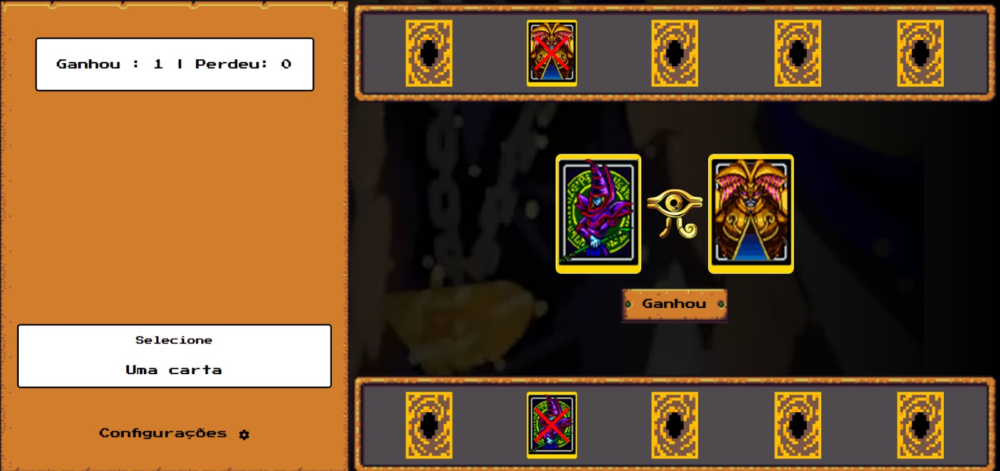

# 🃏 Yu-Gi-Oh | Jo-Ken-Po Edition

Uma recriação divertida do universo **Yu-Gi-Oh!** com a mecânica clássica de **Jo-Ken-Po (Pedra, Papel e Tesoura)**. Desenvolvido com **HTML, CSS e JavaScript puro**, o jogo proporciona uma experiência nostálgica e envolvente para fãs da franquia e entusiastas de jogos casuais.

---

## 🎮 Como funciona o jogo

- Ao iniciar, o jogador e o computador recebem **5 cartas sorteadas aleatoriamente**.
- Cada carta representa um personagem com um atributo baseado em Jo-Ken-Po:
  - 🐉 **Dragão Branco de Olhos Azuis** → Papel
  - 🧙 **Mago Negro** → Pedra
  - 🕷️ **Exodia** → Tesoura
- Ao clicar em uma carta:
  - Ela é exibida à esquerda com **imagem, nome e atributo**.
  - A carta utilizada é marcada e não pode ser jogada novamente.
- O jogo continua até todas as cartas serem utilizadas.
- Ao final, é exibida uma **tela de resultado** com a opção de **jogar novamente**.

---

## 🌟 Funcionalidades

- 🔊 **Controle de volume**: ajuste o som conforme sua preferência.
- 🌍 **Suporte a múltiplos idiomas**: alterne entre português e inglês.
- 📱 **Design responsivo**: compatível com computadores, tablets e celulares.

---

## 🛠️ Tecnologias utilizadas

- **HTML5** — estrutura da aplicação.
- **CSS3** — estilização temática e responsiva.
- **JavaScript (Vanilla)** — lógica do jogo.

---

## 📸 Demonstração



---

## 🚀 Como jogar localmente

 Clone o repositório:

   ```bash
   git clone https://github.com/lucas-0liveira/Yugioh.git
   ```

## 🔁 Jogue agora

👉 [**Clique aqui para jogar online**](https://lucas-0liveira.github.io/Yugioh)

Desafie o computador em batalhas estratégicas de cartas baseadas no clássico Jo-Ken-Po com personagens icônicos do universo *Yu-Gi-Oh!*.

---

## 💡 Inspiração

Este projeto une a nostalgia de *Yu-Gi-Oh!* com a simplicidade e estratégia do Jo-Ken-Po, criando uma experiência divertida, rápida e envolvente. Uma homenagem aos duelos clássicos com um toque moderno e acessível.

---

## 🤝 Contribuições

Contribuições são muito bem-vindas!  
Se você deseja propor melhorias, corrigir bugs ou adicionar novas funcionalidades:

1. Faça um **fork** do repositório
2. Crie uma branch com suas alterações
3. Envie um **Pull Request**

Vamos construir algo ainda melhor juntos!

---

## 🏆 Créditos

Este projeto foi desenvolvido como parte de um desafio educacional da [Digital Innovation One (DIO)](https://web.digitalinnovation.one/).

---

Aproveite e divirta-se com o **Yu-Gi-Oh | Jo-Ken-Po**!  
Se você curtiu o projeto, não esqueça de deixar uma ⭐ no repositório para apoiar o desenvolvimento!